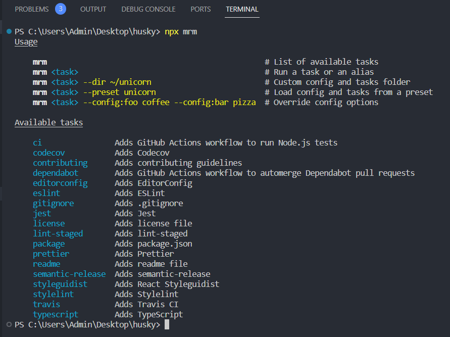

## 使用 [mrm](https://github.com/sapegin/mrm) 实现工程规范化配置

为了规范项目工程以及提交信息，开发人员会借助一些代码格式化或质量检查工具，如prettier、eslint、pre-commit、commit-msg。  
但是这些东西配置起来太繁琐且复杂了，因此mrm出现就是为了解决这种配置繁琐问题。

一行命令即可完成「配置文件创建」、「忽略文件创建」、「package.json文件修改」等步骤。

## 查看mrm支持的所有预设

```bash
npx mrm
```



## 配置 eslint

```bash
npx mrm@2 eslint
```

## 配置 prettier

```bash
npx mrm@2 prettier
```

## 配置 lint-staged

```bash
npx mrm@2 lint-staged
```

然后根据自身项目需求修改prettier和eslint配置文件。
